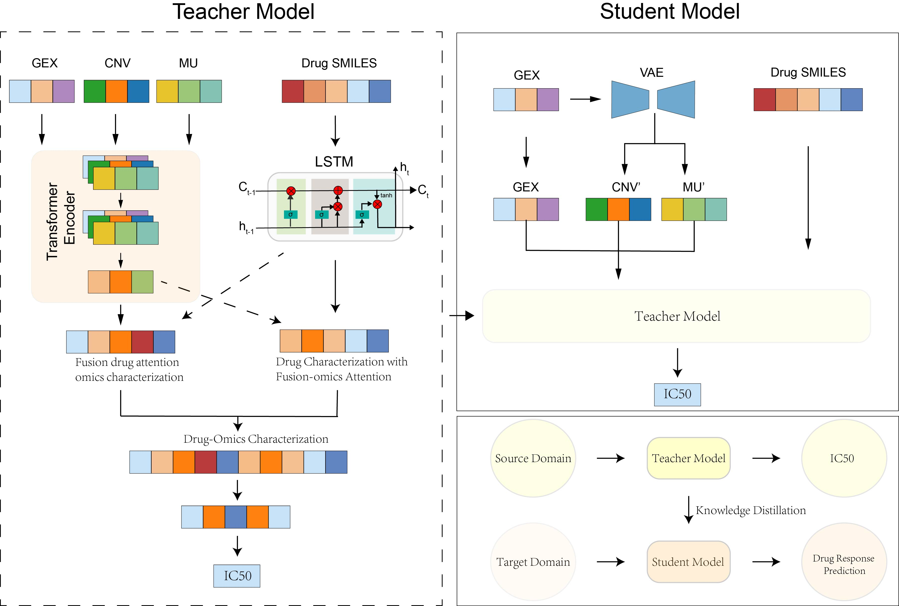

# MKDR

`MKDR`(Modality-incomplete and Knowledge distillation for Drug Response Prediction) is a deep learning model designed to address the challenge of modality missingness, enabling accurate prediction of cellular drug responses even when only partial omics data are available. The model leverages a multi-omics Transformer encoder to extract cellular features, completes missing modalities via a variational autoencoder, and enhances robustness and generalization in real-world clinical settings through a teacher–student distillation framework. Additionally, it incorporates a cross-modal attention mechanism to focus on key biological signals, achieving a balance between predictive performance and interpretability.



## Features

- **High Accuracy**: The student model achieved an impressive performance on the test set, with a mean squared error (MSE) of only 0.0034.
- **Multi-omics**: Integrates multi-omics data to accurately predict cellular responses to drugs.
- **Modality Completion**: Addresses missing modality data by using a variational autoencoder to reconstruct the absent omics, enabling accurate prediction of cellular responses to drugs.
- **Knowledge Distillation**: Enhances model robustness and generalization by leveraging a teacher–student distillation framework.

## Getting Started

Ensure you have the following prerequisites installed:
- Python >= 3.11.x
- PyTorch == 2.5.0 
- NumPy == 1.26.4
- Pandas == 2.2.2


### Installation

To use the `X-scPAE` model, clone the repository:

```bash
git clone https://github.com/bowei-color/MKDR.git
```

Create a virtual environment using conda:

```bash
conda create --name environment_for_xscpae python=3.11
```

Activate the virtual environment

```bash
conda activate environment_for_mkdr
```

Navigate to the project directory

```bash
cd MKDR/code
```

### Usage

To run the model with the provided dataset, execute the following command:

```python
python main.py 
```

## Documentation
The project documentation provides a detailed description of the model, the logic of the algorithm, an explanation of the parameters, and a guide on how to reproduce the experimental results. Here is a summary of the documentation:

- **Model Architecture**: The MKDR model is built upon a multi-omics Transformer encoder to extract cellular features, utilizes a variational autoencoder to complete missing modalities, and leverages a teacher–student distillation framework to enhance the model's robustness and generalization capability.
- **Algorithm Logic**: The model employs a cross-modal attention mechanism to focus on key biological signals, balancing predictive performance with interpretability.

## Results
Our model has been tested on multiple datasets, and here is a summary of some key results:

- **Accuracy**: The model achieved an MSE of just 0.0034 and an R² score of 0.8126 on the test set.
- **Performance Metrics**: The model also demonstrated strong performance in terms of RMSE, MAE, Pearson correlation, and Spearman correlation coefficients.
- **Model Comparison**: Compared to existing methods, MKDR has shown significant improvements across various evaluation metrics.

## Contributing

Contributions to the project are welcome. Please submit a pull request or create an issue in the GitHub repository.

## Contact Authors

Dr. Bowei Yan: boweiyan2020@gmail.com
